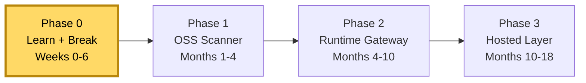

# Shiva — MCP / Agent-Tool Security

> **Codename:** Shiva *(repo name — guardian/destroyer; public product name TBD, see [improvements](docs/improvements.md#0-naming))*
> **Owner:** Kuldeep · **Horizon:** 18 months
> **Thesis:** AI agents are getting real tools faster than anyone is securing the layer where tools meet the agent. Own the **detection + policy layer** for the Model Context Protocol (MCP) — open-source first, hosted product later.

---

> 🌐 **Live site:** once GitHub Pages is enabled (Settings → Pages → Source: *GitHub Actions*), all charts are published at
> **https://rudraxdevelopment98-cell.github.io/shiva/** — one clean link, with nav + search. Built automatically on every push via [`.github/workflows/docs.yml`](.github/workflows/docs.yml).

## 🧭 This repo is the control room

Everything about the project — goal, where we are, what's next, what we're building, what we're learning — lives here as **linked Markdown + Mermaid charts**. It renders automatically on GitHub, and you can open the same folder in **[Obsidian](docs/how-to-view.md)** for an interactive mindmap/graph view.

| Doc | What it answers | Chart type |
|---|---|---|
| **[Overview / Mindmap](docs/overview.md)** | What is the whole thing, at a glance | Mindmap |
| **[Roadmap](docs/roadmap.md)** | Where are we going, by when | Gantt + phase state machine |
| **[Progress board](docs/progress.md)** | Where are we *right now* | Kanban + current sprint |
| **[Learning tracker](docs/learning.md)** | What do I need to learn, what's done | Mindmap + checklist |
| **[Architecture](docs/architecture.md)** | What are we building | System flowcharts |
| **[Threat model](docs/threat-model.md)** | What are we defending against | Attack flow + MITRE/OWASP map |
| **[Platform](docs/platform.md)** | The hosted app we'll build (accounts, admin, access control) | Mindmap + RBAC chart |
| **[Improvements](docs/improvements.md)** | How to make the plan sharper | Notes + decision log |
| **[Evidence / claims](docs/evidence.md)** | Are our market claims actually true | Sourced living doc |
| **[▶ Getting started](docs/getting-started.md)** | Do-this-now first week (Phase 0) | Guide |
| **[How to view these charts](docs/how-to-view.md)** | Tooling setup (free) | Guide |
| **[Mac + SSD setup](docs/setup-mac.md)** | Run it all off an external SSD + GitHub | Guide |
| **[Supabase setup](docs/supabase-setup.md)** | Make the portal real (multi-user auth + DB) | Guide |

---

## 📍 Status snapshot

**We are here:** Phase 0, Day 0 — repo just scaffolded. Next action: see the **[first 7 days](docs/progress.md#first-7-days)**.

---

## How to keep this alive

This is a *living* dashboard, not a one-time doc. The rule:

- When you **learn** something → tick it in [learning.md](docs/learning.md).
- When you **finish** a task → move the card in [progress.md](docs/progress.md).
- When you **decide** something → log it in [improvements.md](docs/improvements.md#decision-log).
- When you **cite a stat** → it must have a row in [evidence.md](docs/evidence.md).

One commit per meaningful update keeps the git history a record of the journey.
