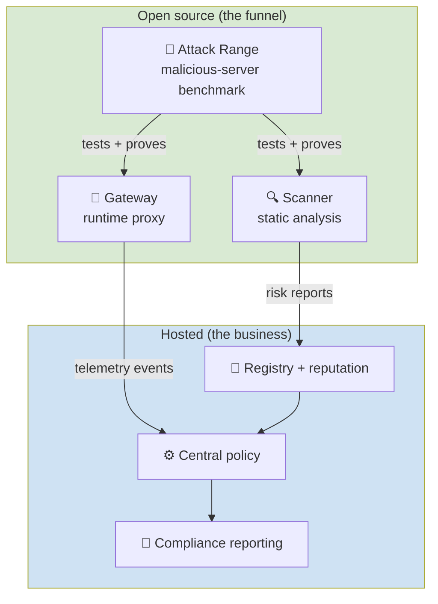
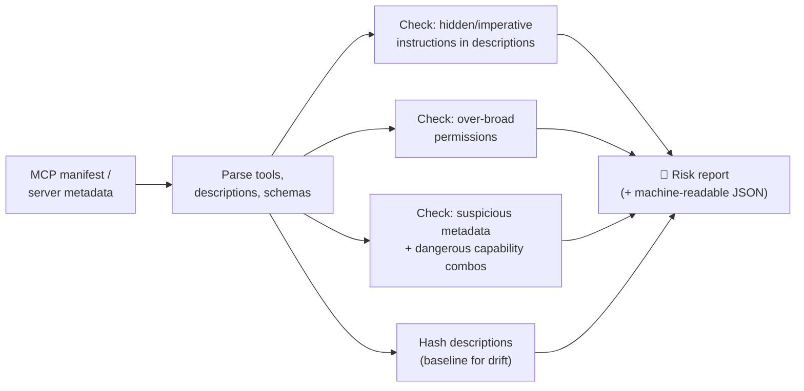
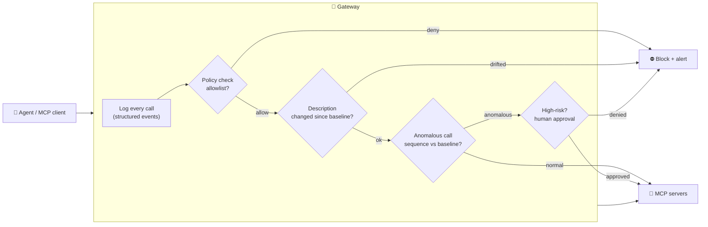
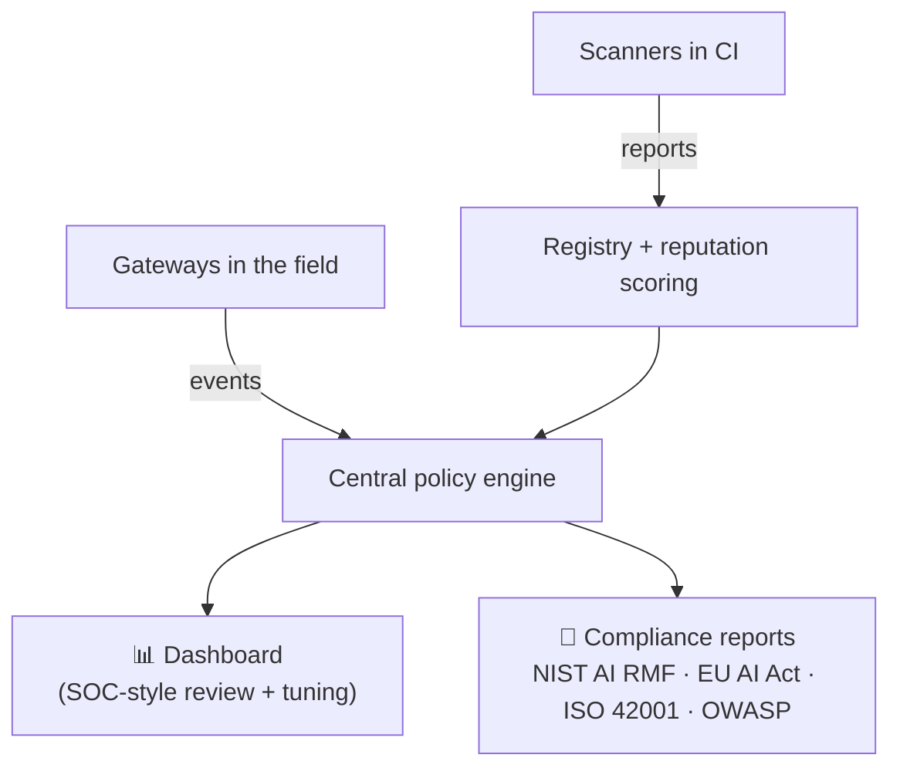

# Architecture — what we're building

[← back to control room](index.md)

Three components, one growing system. Open-source funnel (Scanner + Gateway + Attack Range) feeds the paid Hosted layer.

## The whole system

## Scanner

Input: an MCP server / tool manifest. Output: a risk report. Runs as **CLI + CI check**.

## Gateway (the SOC pipeline)

A proxy between the agent/client and the MCP servers. This is where your SOC instincts map 1:1.

> **Design rule:** measure false-positive rate on the Attack Range *before* arming any auto-block. Detect first, enforce later.

## Hosted layer

## Tech stack (keep it boring)

| Layer | Choice | Why |
|---|---|---|
| Scanner + detection | **Python** | Fits security-tooling instincts |
| Gateway | **TypeScript/Node** (Go later for single binary) | MCP SDKs are first-class in TS |
| Storage (local) | **SQLite / DuckDB**, JSON logs | No Kafka/Elastic on day one |
| Sandboxing | **Docker** | Run untrusted servers safely |
| Telemetry (stretch) | **OpenTelemetry GenAI semantic conventions** | Plugs straight into existing SIEM/SOC — see [improvements](improvements.md#5-emit-opentelemetry-genai-semantic-conventions) |

Next: [threat model →](threat-model.md)
