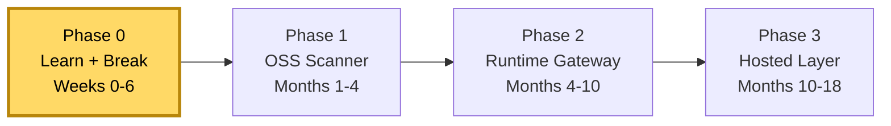

# Shiva — MCP / Agent-Tool Security

> **Codename:** Shiva · **Owner:** Kuldeep · **Horizon:** 18 months
> **Thesis:** AI agents are getting real tools faster than anyone is securing the layer where tools meet the agent. Own the **detection + policy layer** for the Model Context Protocol (MCP) — open-source first, hosted product later.

This is the **control room** — every chart and tracker for the project, all linked. Use the nav (left) or the cards below.

## The docs

| Doc | What it answers | Chart type |
|---|---|---|
| **[Overview / Mindmap](overview.md)** | What is the whole thing, at a glance | Mindmap |
| **[Roadmap](roadmap.md)** | Where are we going, by when | Gantt + state machine |
| **[Progress board](progress.md)** | Where are we *right now* | Kanban + current sprint |
| **[Learning tracker](learning.md)** | What to learn, what's done | Mindmap + checklist |
| **[Architecture](architecture.md)** | What we're building | System flowcharts |
| **[Threat model](threat-model.md)** | What we're defending against | Attack flow + standards map |
| **[Platform](platform.md)** | The hosted app (accounts, admin, access control) | Mindmap + RBAC chart |
| **[Improvements](improvements.md)** | How to sharpen the plan | Notes + decision log |
| **[Evidence / claims](evidence.md)** | Are our market claims true | Sourced living doc |
| **[▶ Getting started](getting-started.md)** | Do-this-now first week (Phase 0) | Guide |
| **[How to view](how-to-view.md)** | Tooling setup (free) | Guide |
| **[Mac + SSD setup](setup-mac.md)** | Run it all off an external SSD + GitHub | Guide |
| **[Supabase setup](supabase-setup.md)** | Make the portal real (multi-user auth + DB) | Guide |

## Status snapshot

**We are here:** Phase 0, Day 0 — repo scaffolded, docs site live. Next: the **[first 7 days](progress.md#first-7-days)**.

---

*This site is built from the Markdown in [`/docs`](https://github.com/rudraxdevelopment98-cell/shiva/tree/claude/dazzling-galileo-j9yt04/docs) with MkDocs Material and auto-deploys on every push. Edit the source, push, and the site updates itself.*
