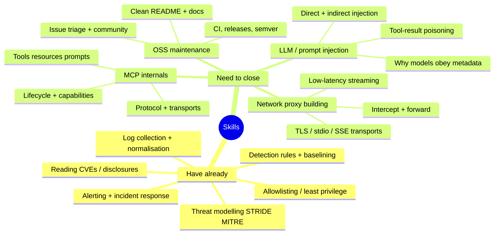

# Learning tracker — what to learn, what's done

[← back to control room](index.md)

> Your background already covers a lot (SOC / MSc). This tracks only the **gaps to close** plus where each gap plugs into the product.

## Knowledge map

## Gap → where it's used

| Gap to close | Why you need it | Plugs into |
|---|---|---|
| **MCP internals** | Can't secure what you don't understand | All phases |
| **LLM / prompt-injection specifics** | The attacks ARE injection | Scanner checks, threat model |
| **Building a network proxy** | The gateway *is* a proxy | Phase 2 |
| **OSS project maintenance** | Distribution = reputation | Phase 1 onward |

## Checklist (tick as you learn)

### MCP internals
- [ ] Read the MCP spec: tools, resources, prompts, sampling
- [ ] Understand transports: stdio, SSE, streamable HTTP
- [ ] Build a server + client by hand (both SDKs)
- [ ] Understand the capability-negotiation handshake

### Prompt injection
- [ ] Direct vs indirect injection — clear mental model
- [ ] Read Simon Willison's MCP injection post
- [ ] Reproduce tool-poisoning yourself ([attack #1](threat-model.md#1-tool-poisoning))
- [ ] Understand tool-result / cross-tool poisoning

### Proxy engineering
- [ ] Build a pass-through stdio proxy that logs traffic
- [ ] Add structured JSON event emission
- [ ] Measure added latency
- [ ] Add an allow/deny decision point

### OSS maintenance
- [ ] Clean README + quickstart that a stranger can follow
- [ ] CI green on every PR
- [ ] First tagged release
- [ ] Issue/PR templates + contributing guide

## Notes / write-ups log

Every reproduction becomes a public write-up (learning *and* credibility). Track them:

| # | Topic | Status | Link |
|---|---|---|---|
| 1 | Tool poisoning | ⏳ | _(add blog/repo link)_ |
| 2 | Description drift / rug-pull | 🔒 | |
| 3 | Cross-tool escalation | 🔒 | |

Next: [architecture →](architecture.md)
