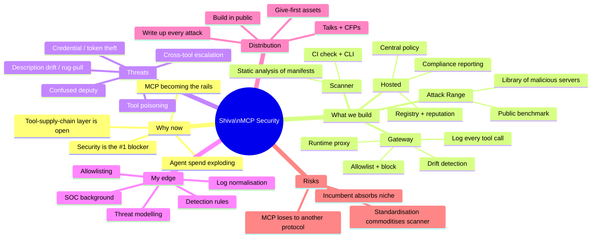
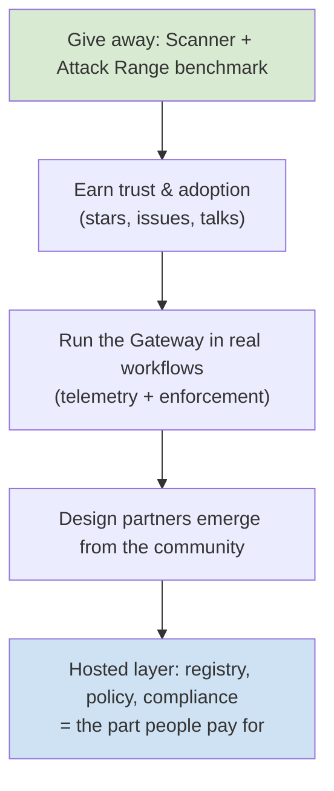

# Overview — the whole project on one screen

[← back to control room](index.md)

## The mindmap

## The single sentence

> Be the team that owns **detection and policy for the layer where agents call tools**, by giving away the scanner + a malicious-server benchmark to build trust, then charging for the hosted registry/policy/compliance layer that enterprises are forced to buy.

## The shape of the bet

See also: [roadmap](roadmap.md) · [architecture](architecture.md) · [improvements](improvements.md)
