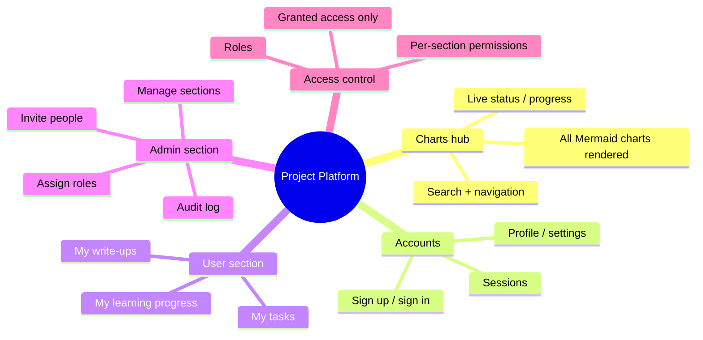
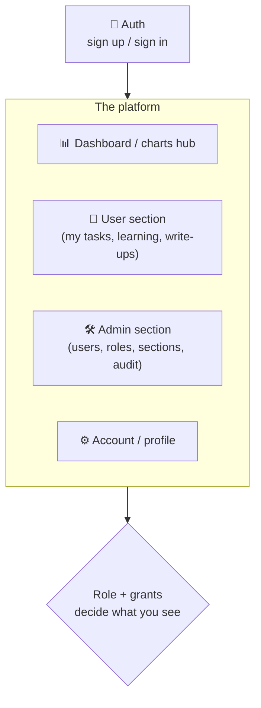
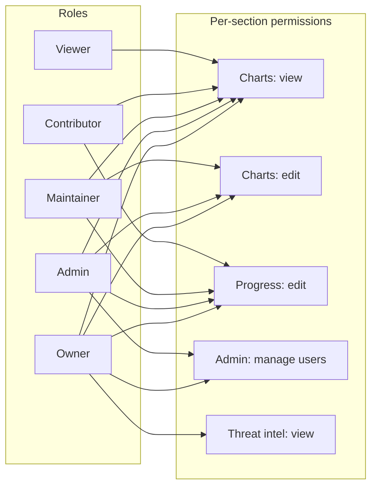
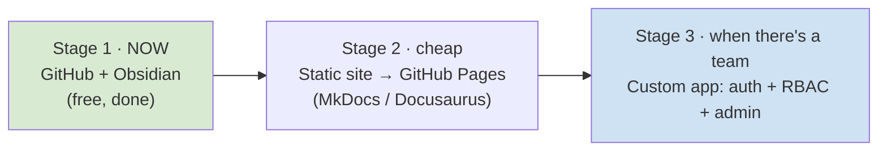

# Platform — the hosted project command-center

[← back to control room](index.md)

> **Vision (Kuldeep):** turn this control room into our own **web platform** — where we view all the charts, plus user accounts, a user section, an admin section, and **role-based access** so collaborators only see/edit what they're granted. The chart structure lives inside it too.

This is a **real planned component**, but sequenced carefully — see [§ When to build](#when-to-build-it-staged) so it doesn't steal time from Phase 0.

---

## What it is

## Sections of the app

## Access-control model (RBAC)

The core of your ask: people get access **only to the particular things they're granted**.

### Access matrix (starting point — tune later)

| Capability | Owner | Admin | Maintainer | Contributor | Viewer |
|---|:--:|:--:|:--:|:--:|:--:|
| View charts/dashboard | ✅ | ✅ | ✅ | ✅ | ✅ |
| Edit charts/docs | ✅ | ✅ | ✅ | ➖ | ➖ |
| Update progress board | ✅ | ✅ | ✅ | ✅ | ➖ |
| View threat intel / sensitive | ✅ | ✅ | ✅ | grant-based | ➖ |
| Invite people | ✅ | ✅ | ➖ | ➖ | ➖ |
| Assign roles | ✅ | ✅ | ➖ | ➖ | ➖ |
| Manage sections | ✅ | ✅ | ➖ | ➖ | ➖ |
| View audit log | ✅ | ✅ | ➖ | ➖ | ➖ |

> Beyond roles, support **per-resource grants** (e.g. "give Asha edit on *only* the Learning section") for the "access to particular things" requirement. Roles = defaults; grants = overrides.

---

## When to build it (staged)

Don't jump straight to a custom auth platform — it's weeks of work that competes with Phase 0. Three stages, each a real upgrade, cost rising only as the need is proven:

| Stage | What you get | Cost / effort | Build it when |
|---|---|---|---|
| **1 — now** | Charts on GitHub + Obsidian graph | Free, already done | ✅ today |
| **2 — soon** | One hosted URL, nav, search, all charts rendered — a real "platform feel", still no login needed | Free (GitHub Pages), ~1 day | When you want a shareable site / before talks |
| **3 — later** | Accounts, user/admin sections, RBAC, per-section grants | Real build, ~weeks | **Only when you actually add people** to the project |

**Recommendation:** ship Stage 2 (MkDocs Material → GitHub Pages) when you want a clean public home; defer Stage 3 until a real collaborator joins — that's the first moment RBAC earns its complexity.

### Stage 3 tech (boring + free-tier, fits your constraints)
- **Frontend:** Next.js (or Astro) — renders the same Markdown/Mermaid you already have.
- **Auth + DB + RBAC:** **Supabase** (Postgres + Auth + Row-Level Security) free tier — RLS enforces per-section/per-row grants at the database, which is the clean way to do "access to particular things." Clerk/Auth0 are alternatives for auth.
- **Hosting:** Vercel free tier.
- **Reuse:** point it at this repo's `docs/` so the platform and the source of truth never diverge.

> 🔮 **Possible synergy:** this internal platform's RBAC + audit-log work overlaps with the **Shiva hosted layer** (central policy, dashboards, multi-team access). Build the internal one so pieces can graduate into the product later. Logged as an open question below.

---

## Open questions

- Is this platform **internal-only** (project hub) or does it eventually merge into the **Shiva product's** hosted dashboard? *(Leaning: build internal first, let components graduate.)*
- Self-host vs managed auth?
- Do collaborators edit charts in-app, or still via git PRs (app read-only over git)?

See the [decision log](improvements.md#decision-log) for choices as they're made.

[← back to control room](index.md)
