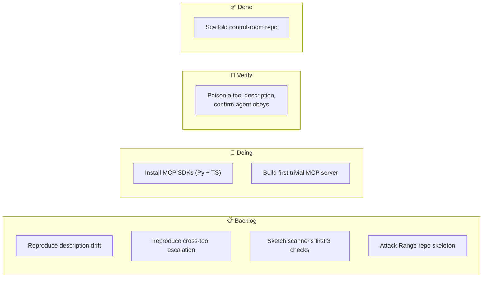

# Progress board — where we are *right now*

[← back to control room](index.md)

> Update this on every meaningful step. This is the "you are here" map.

**Current phase:** Phase 0 — Learn + Break
**Current focus:** First 7 days
**Last updated:** 2026-06-10

## Kanban

## First 7 days

A live checklist — tick as you go (`[x]`).

- [ ] **Day 1** — Install MCP SDKs (Python + TypeScript) on the Mac.
- [ ] **Day 2** — Build one trivial MCP server (e.g. a "read file" tool) + connect a client.
- [ ] **Day 3** — Poison a tool description with a hidden instruction; confirm the agent obeys it.
- [ ] **Day 4** — Create/commit the public test server + a short write-up of attack #1. *(repo already exists — just push attack #1)*
- [ ] **Day 5** — Read the MCP threat-modelling papers + Simon Willison's MCP prompt-injection post; note against your own reproduction. ([sources](evidence.md#reading-list-phase-0))
- [ ] **Day 6** — Sketch the scanner's first three checks on paper → drop into [architecture.md](architecture.md#scanner).
- [ ] **Day 7** — Decision gate 0: am I in for Phase 1?

## Decision gates — status

| Gate | Question | Status |
|---|---|---|
| 0 | Interesting enough for 18 months? | ⏳ pending (end of Phase 0) |
| 1 | Anyone outside me adopted the scanner? | 🔒 locked (Phase 1) |
| 2 | A credible design partner willing? | 🔒 locked (Phase 2) |

## Signals to watch (your real metrics)

- ⭐ GitHub stars / forks / issues on scanner + Attack Range
- 🧪 Attack Range: # of distinct attack classes covered
- 🎯 Scanner detection rate vs false-positive rate on the Range
- ⚡ Gateway latency overhead (ms per tool call)
- 🗣️ Inbound: people opening issues / asking to use it / CFP acceptances

Next: [learning tracker →](learning.md)
