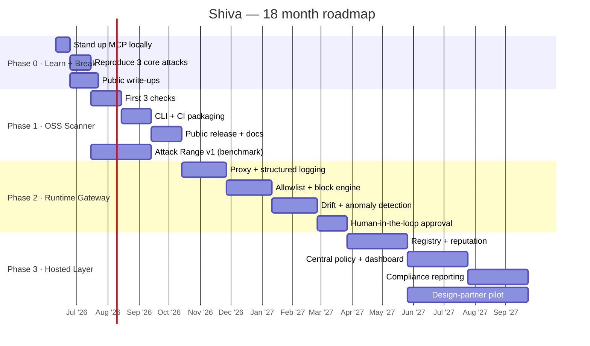
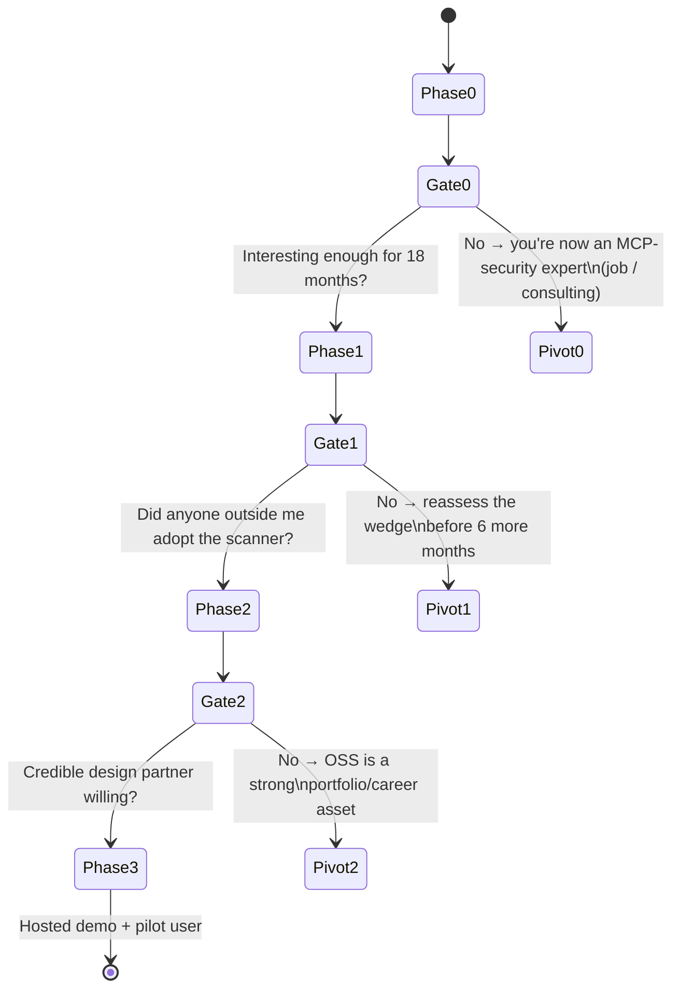

# Roadmap — where we're going, by when

[← back to control room](index.md)

## Timeline (Gantt)

## Phase state machine + decision gates

Each phase ends at a **gate**: you either continue, or you pivot with a still-valuable asset in hand.

## Definition of done per phase

| Phase | Done when… |
|---|---|
| **0** | You can demo **3 working attacks** and explain each from first principles. |
| **1** | **Someone who isn't you** runs the scanner on their own MCP setup and finds it useful. |
| **2** | The gateway sits in front of a real agent workflow, logs it, and **blocks a poisoned/drifted tool in real time** without breaking normal use (with a measured false-positive rate). |
| **3** | Deployable hosted demo **+ at least one design partner / pilot user** giving feedback. |

Next: [progress board →](progress.md)
