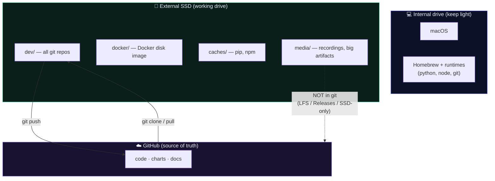

# Mac + External SSD setup (M2 Pro · 16GB · 512GB)

[← back to control room](index.md)

> Goal: keep the **internal drive light**, do all project work on an **external SSD**, and keep everything backed by **GitHub**. This project is pure software (no model training / GPU), so this works cleanly.

## TL;DR decisions

| Question | Answer | Why |
|---|---|---|
| 256GB or 512GB SSD? | **512GB** | Docker images (20–60GB), node_modules, venvs, and demo recordings add up. 256 means constant cleanup. |
| Format? | **APFS** (default, case-insensitive) | exFAT breaks symlinks / permissions / case that git, Node, Python need. |
| Drive type? | Any **USB 3.2 Gen2** portable SSD (~1000MB/s): Samsung T7/T9, Crucial X9 Pro, SanDisk Extreme | Thunderbolt is overkill for code. |
| Source of truth? | **GitHub** | SSD is your working copy; GitHub is the backup. Cloud sessions clone fresh from GitHub anyway. |

## Where everything lives



## One-time setup

### 1. Format the SSD (APFS)
Disk Utility → select the SSD → **Erase** → Format: **APFS**, Scheme: **GUID Partition Map**. Name it e.g. `SHIVA`.

### 2. Folder layout on the SSD
```
/Volumes/SHIVA/
├── dev/            # all your git repos
│   └── shiva/      # this repo (git clone here)
├── docker/         # relocated Docker Desktop disk image
├── caches/         # pip + npm caches (optional)
└── media/          # screen recordings, datasets — NOT committed to git
```

### 3. Clone the repo onto the SSD
```bash
cd /Volumes/SHIVA/dev
git clone https://github.com/rudraxdevelopment98-cell/shiva.git
cd shiva
```

### 4. Move Docker's storage to the SSD (the big space saver)
Docker Desktop → **Settings → Resources → Advanced → Disk image location** → set to `/Volumes/SHIVA/docker`. Also cap Docker's RAM at ~6GB (you have 16GB total).
> ⚠️ Mount the SSD **before** launching Docker, or it'll recreate storage on the internal drive.

### 5. (Optional) Redirect package caches to the SSD
```bash
# npm
npm config set cache /Volumes/SHIVA/caches/npm
# pip — add to ~/.zshrc
export PIP_CACHE_DIR=/Volumes/SHIVA/caches/pip
```

### What to keep on the **internal** drive
Homebrew, Python, Node, and git themselves. Relocating those to external is painful and fragile — and they're small. Keep runtimes internal; keep *projects, Docker data, caches, and media* external.

## Keeping it "fully in GitHub"

✅ **Goes in git (text/code):** everything in `docs/`, `web/`, `attack-range/`, charts, configs. This is already the case — keep committing and pushing.

🚫 **Does NOT belong in git history (large binaries):** attack-demo **screen recordings**, datasets, big images. They bloat the repo forever. Options:
- **Git LFS** for files you truly want versioned in GitHub (`git lfs track "*.mp4"`).
- **GitHub Releases** — attach a demo video to a release instead of committing it.
- **SSD-only** + a link (YouTube unlisted / cloud) from the write-up.

These media patterns are already in [`.gitignore`](https://github.com/rudraxdevelopment98-cell/shiva/blob/claude/dazzling-galileo-j9yt04/.gitignore) territory — extend it as needed.

## Backup reality check

- **Code** is safe: it's on the SSD *and* GitHub. If the SSD dies, `git clone` and you're back.
- **Non-git files on the SSD** (recordings, scratch) have **no second copy**. For anything there you can't regenerate, keep a Time Machine backup of the SSD or copy to cloud.
- An SSD can disconnect mid-build — fine for code (just reconnect), but never run the OS or Time Machine's only copy off it.

## Daily rhythm
```bash
# start of session
cd /Volumes/SHIVA/dev/shiva && git pull origin claude/dazzling-galileo-j9yt04
# ... work ...
git add -A && git commit -m "..." && git push        # end of session = backed up
```

[← back to control room](index.md)
